# !!ONLY INTENDED FOR DEVELOPMENT!!

This guide assumes you know how to install an OS like Debian 11 and have experience with web development. DO NOT use this for hosting a production website!

## 1. Download Debian 11 ISO
https://www.debian.org/releases/bullseye/debian-installer/

## 2. Download VirtualBox
https://www.virtualbox.org/

## 3. Create new VM on VirtualBox

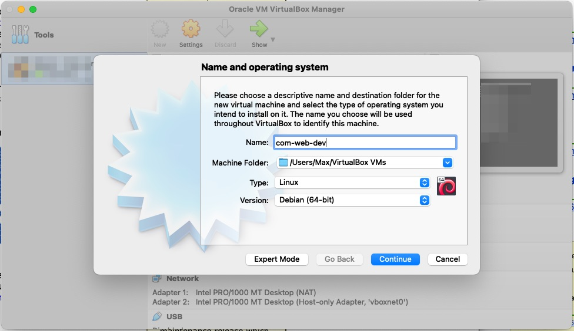
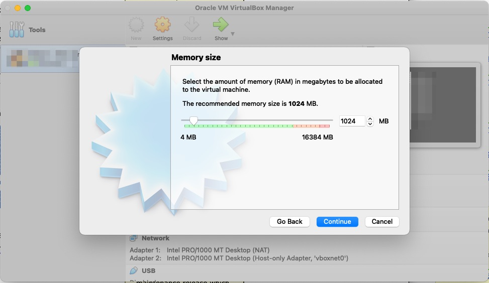
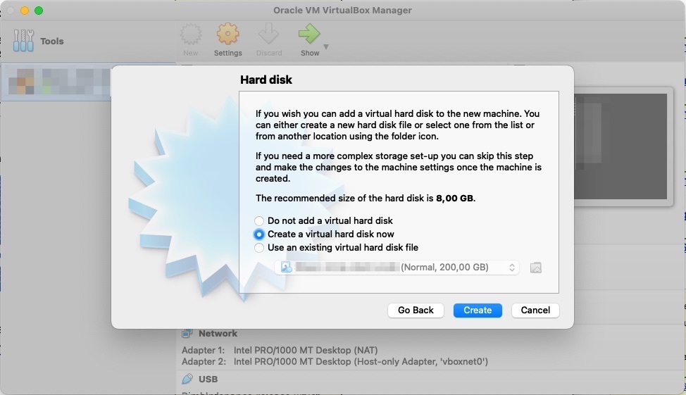
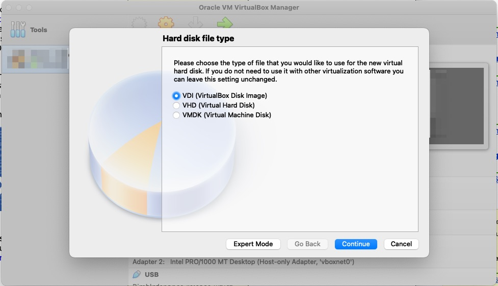
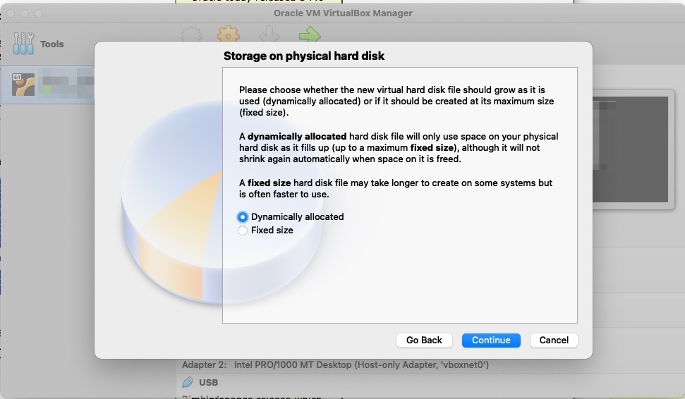
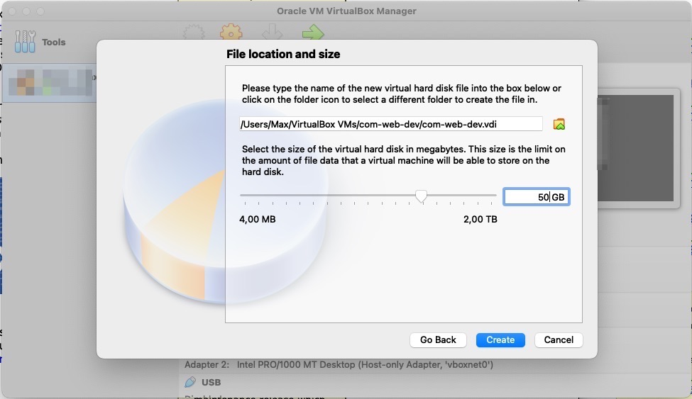
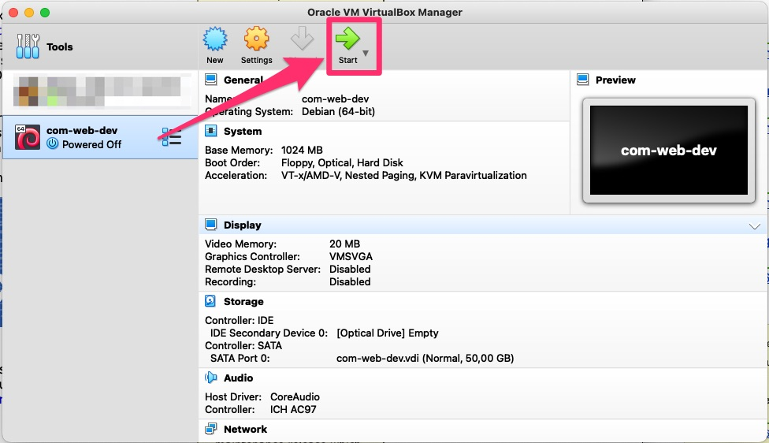

## 4. Attach Debian 11 ISO
Start the VM and attach the ISO


## 5. Install Debian 11 and enable SSH
Walk through the setup and make sure to enable SSH server

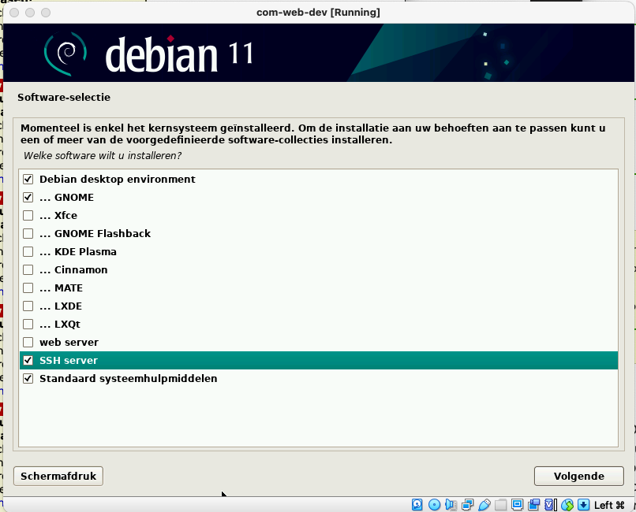

## 6. Stop VM & configure
Stop the VM and configure the stuff below

### Attach networks
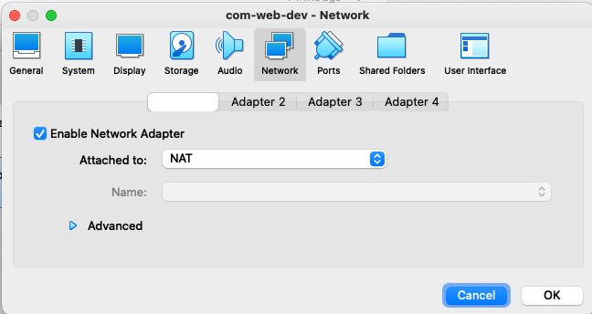


## 6. Start VM & prep VM

### Network adapters
```bash
su -
nano /etc/network/interfaces
```

Change to (adjust interface ID's if necessary):
```bash
# The loopback network interface
auto lo
iface lo inet loopback

auto enp0s3
iface enp0s3 inet dhcp

#droplet connect to host
auto enp0s8
iface enp0s8 inet static
address 192.168.56.102
netmask 255.255.255.0
dns-nameserver 1.1.1.1 1.0.0.1
```


### Attach shared dir
Select the folder on your host machine, where the Community website source code is located.

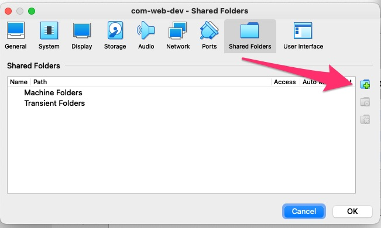
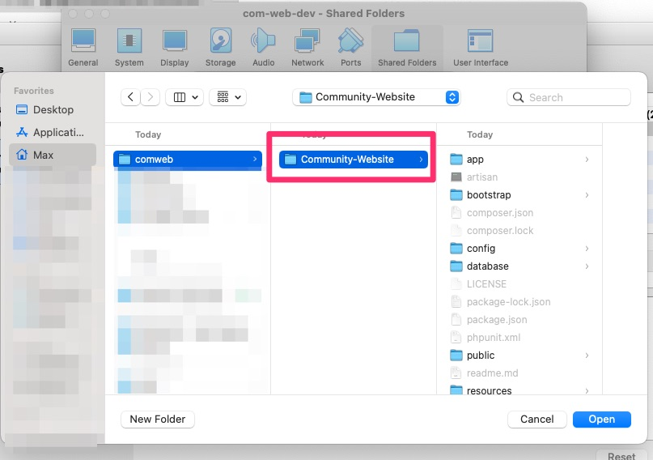
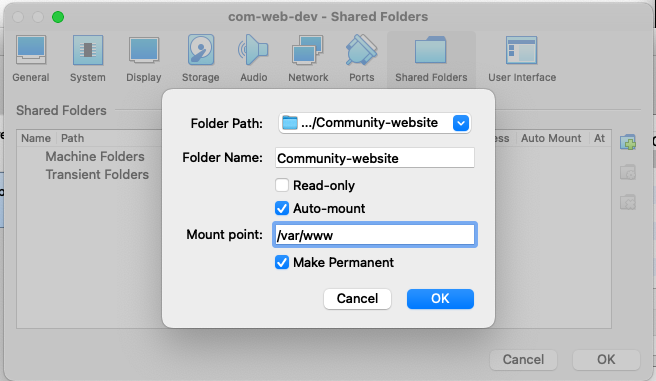

### Activate SSH
```composer log
nano /etc/ssh/sshd_config
```

Add:
```composer log
PermitRootLogin yes
```

Save the file and restart SSH
```composer log
service sshd restart
```


### VirtualBox requirements
Install VirtualBox Guest additions using following guide:
https://linuxopsys.com/topics/install-virtualbox-guest-additions-on-debian

After rebooting, confirm `/var/www` is mounted to the folder on your host machine, and you can see the source files.

## 6. Open terminal on VM & run script
From here on out, it's best to always connect with the VM via SSH using the `root` account.

### Create self-signed cert for your test url

While running the command below you will be asked to fill in some info. You can leave almost ever field blank.

Replace `my.testdomain.com` in the screenshot below to the domain you will be using for testing locally.
You can use any domain when overwriting the IP in your hostfile to bind it to the test vm.

```bash
openssl req -x509 -nodes -days 9999 -newkey rsa:2048 -keyout /etc/ssl/certs/selfsigned.crt -out /etc/ssl/certs/selfsigned.crt
```

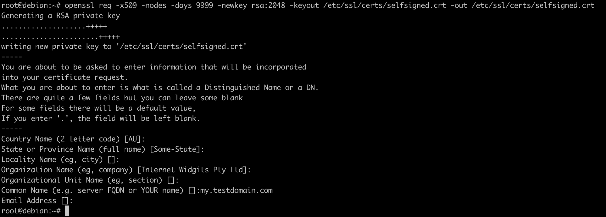

### Install all required software to host website
```
wget -O install.sh https://raw.githubusercontent.com/GameserverApp/Community-Website/master/scripts/install-DEV-ONLY.sh && chmod +x install-DEV-ONLY.sh && bash install-DEV-ONLY.sh
```

when finished, run 
```
source ~/.bash_profile
source ~/.bashrc
```

## Build assets on host machine

### Install NVM on host
Install NVM on the host machine: https://tecadmin.net/install-nvm-macos-with-homebrew/

Install: `nvm install 14.19.0;`

On the host machine, open a terminal and navigate to the `Community-website` folder. Run the commands below to install the required packages (only required the first time you install the website).

```composer log
npm install
```

When you made changes to CSS / SCSS files, run the command below to manually rebuild the assets:
```composer log
npm run development
```

or use `watch` to rebuild when updates were detected

```composer log
npm run watch
```

## Generate .env

Recommended `.env` settings:
```composer log
APP_DEBUG=true
APP_ENV=local
APP_KEY=""

CACHE_DRIVER=redis
REDIS_HOST=127.0.0.1

DOMAIN_OVERWRITE=my.testdomain.com

#option to disable cache, for testing purposes (will make the site slow)
DEFAULT_CACHE_TTL=-1

# use bugsnag to have errors reported to your own bugsnag account
#BUGSNAG_API_KEY=
```